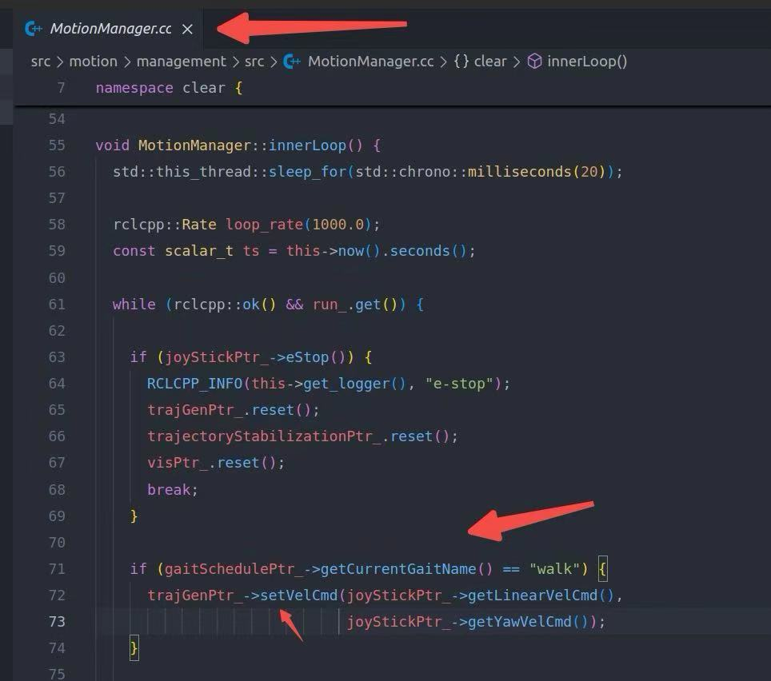

# Model Predictive Control for Bipedal Robot PF_A in MuJoCo Simulator


This work is focused on the study of convex MPC for bipedal robots.
Convex model predictive control can be applied not only to quadruped robots but also to biped robots.

# Important matter
**This project is currently running only on ros2！！**

**Please check the ros versions supported by your operating system！！**

# Build Package
## Install ROS2 according to your operating system (my operating system is ubuntu 22.04 with ros2-humble)
If you are freshman, it is recommended to use this command line in terminal:
```bash
wget http://fishros.com/install -O fishros && . fishros
```
First, choose 1: '一键安装(推荐):ROS(支持ROS/ROS2,树莓派Jetson)'.

Second, choose 1: '更换系统源再继续安装'.

Third, choose 1: 'humble(ros2)'.

Finally, choose 1: 'humble(ros2)桌面版'.

Then, the ros2 is successfully installed. For more details please refer to [fishros](https://github.com/fishros/install). Thank fishros for his contributions!!!!!!!

If ros2 cannot be successfully installed in your operating system, please refer to [ROS2](https://ros.org/) official doc.

## Dependency
```bash
sudo apt update
sudo apt-get install ros-<ros2-distro>-eigenpy
sudo apt-get install ros-<ros2-distro>-pinocchio
sudo apt install libglfw3-dev
```

For ros2(humble)
```bash
sudo apt update
sudo apt-get install ros-humble-eigenpy
sudo apt-get install ros-humble-pinocchio
sudo apt install libglfw3-dev
```

For third party
```bash
git clone https://github.com/giaf/hpipm.git
cd hpipm
git checkout v0.1.0  # 使用兼容版本

# 2. 编译安装
mkdir build && cd build
cmake -DBUILD_SHARED_LIBS=ON ..
make -j$(nproc)
sudo make install
```

## Build
```bash
git clone https://github.com/81578823/Bipedal_MPC.git
```

```bash
cd Bipedal_MPC & bash build.sh
echo "source ~/Bipedal_MPC/install/setup.bash" >> ~/.bashrc
source ~/.bashrc
```

# Run Package
## Run Simulation
```bash
ros2 launch sim sim_launch.py 
```

## Run Controller
```bash
ros2 launch management management_launch.py 
```

# Change Velocity
if don't have the remote controller, you can change the linear velocity and angular velocity on this code file:


Then you can change the velocities on the JoyStick::getLinearVelCmd() and JoyStick::getYawVelCmd() (default: 0.4 (linear); 0.0 (angular))

# Future work
Nowadays, more and more people are used to using python. 
Hence, we will focus on converting the C++ work into a respository in python. So please waiting ...


# Reference
J. Di Carlo, P. M. Wensing, B. Katz, G. Bledt and S. Kim, "Dynamic Locomotion in the MIT Cheetah 3 Through Convex Model-Predictive Control," 2018 IEEE/RSJ International Conference on Intelligent Robots and Systems (IROS), Madrid, Spain, 2018, pp. 1-9, doi: 10.1109/IROS.2018.8594448. keywords: {Robot kinematics;Legged locomotion;Dynamics;Predictive control;Convex functions;Predictive models},


